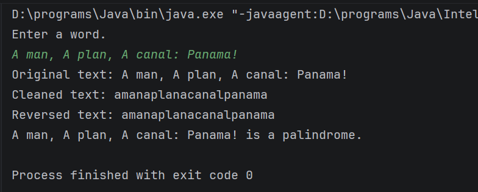

# Palindrome Checker

This program takes an input from a user and checks whether or not it is a 
palindrome (a word or phrase that is the same forward and backward).

## How to run
1. download program.
2. Open program in IntelliJ IDEA.
3. Run PalindromeChecker.java.
4. Enter a word or phrase.
5. Press enter.

## Program output
